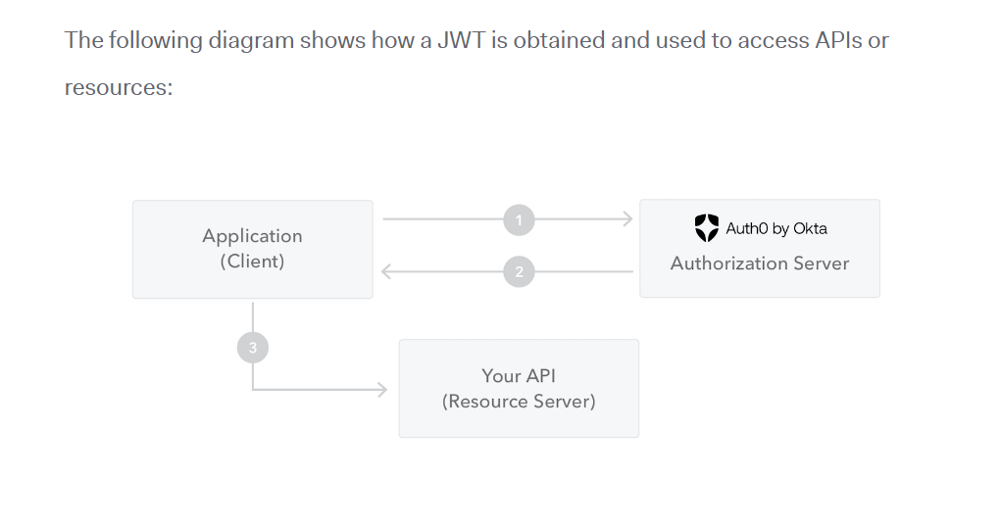

# Notes while Learning the project 


## Apiresponse and Error handling:-

* To handle the error effieciently, standard practice is to define an error class.
* Node js applications have access to a special error class which can be modified as per app uses.

* generally four types of error may occur in node js applications:
    1. Standard Javascript error like `<EvalError>, <SyntaxError>, <RangeError>, <ReferenceError>, <TypeError>, and <URIError>`
    2. System errors due to unxpected access of resources.
    3. User-specified errros as denoted by statuscodes.
    4. AssertionErrors- special class of errors which are detected when exceptional logic violations occurs.

* These errors classess we can control further as per app need. So we can use inheritance property and define our own class ApiError based on Error class from nodejs. in this we can modify the constructors.
* generally we overwrite the constructors as follows:- 
```javascript
class ApiError extends Error {
    constructor(
        statusCode,
        message= "Default wrong message from apiError class",
        errors= [],
        stack= ""
    ){
       super(message)
       
        this.statusCode= statusCode
        this.data= null
        this.success= false
        this.message= message
        this.errors= errors 

        if(stack){
            this.stack= stack
        }else{
            Error.captureStackTrace(this, this.constructor)

        }
    }
}

export {ApiError}
```

## Data Modeling and Authentication strings

* We need to keep in mind all the important data variable while making a data model as it defines the complete structure of how data is saving and how it can be retrieved. Using Mongoose we can control data addition very efficiently. 

* We use inbuilt middlewares in mongoose :- userSchema.pre(). It runs before saving the data. We give access to the data need to be worked , next and then any function given in the parameter can be implemented before some validations.

* While Saving the Password we save a long encrypted password. Whatever user gives as a password we save it after hashing operation by bcrypt.

* Hashing basically means converting given key or string of character into some other unique value, which can further be retrieved for use. Bcrypt use cryptographic algo to generate a unique, meanigless and random string by running a special function number of times.

* brcypt.hash() can be used to generated random string and brcypt.compare() is used to compare the actual password with the stored password.

### JsonWebTokens

* JsonWebTokens are used for authentication, information exchange. Basically it is like a key which can be use to authenticate the client before giving access to any private routes or resources.
* JWT consist of three parts:- 
    1. Headers:- predefined part, consist of type of token, signing algorithm used:
                ```
                    {
                        "alg": "HS256",
                        "typ": "JWT"
                    }
                 ```
    2. Payload:- Data which we want to sign or whatever given by the user.

    3. Signature:- A secret key generated using the encoded header, encoded payload and a secret, using an algorithm. it is further used for verifying the user.

    #### How JWT works? 
    Basically we when the user login with credentials a token is generated. When client try to access the protected routes, then this token is sent to the server where server check it and then acknowledge it for accessing the private resources, routes. JWT is sent using a BEARER SCHEMA.

    

```javascript 
userSchema.methods.generateAccessToken= function (){
   return jwt.sign(
        {
            _id: this._id,
            email: this.email,
            fullName: this.fullName,

        },
        process.env.ACCESS_TOKEN_SECRET,
        {
            expiresIn: process.env.ACCESS_TOKEN_EXPIRY
        }
    )
}

userSchema.methods.generateRefreshToken= function (){
   return jwt.sign(
        {
            _id: this._id,
        },
        process.env.REFRESH_TOKEN_SECRETT,
        {
            expiresIn: process.env.REFRESH_TOKEN_EXPIRY
        }
    )
}
```

## File Upload

